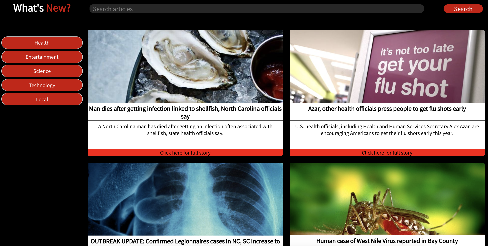

# Abstract

This is a simple news article site, that has 5 different categories of news articles and each article shows a picture, headline, description and includes a link to the full article on another website. This project was an introduction to React. It was divided into  5 components, two of which are class components, the rest are functional.

## Tech and Project Management

This application was built with `create-react-app` and tested with Jest and Enzyme.

For this project I used a Trello board to help myself stay organized and on top of things.

## Screenshot
You can find the live version of the app [here](https://sschipke.github.io/whatsnew/)

